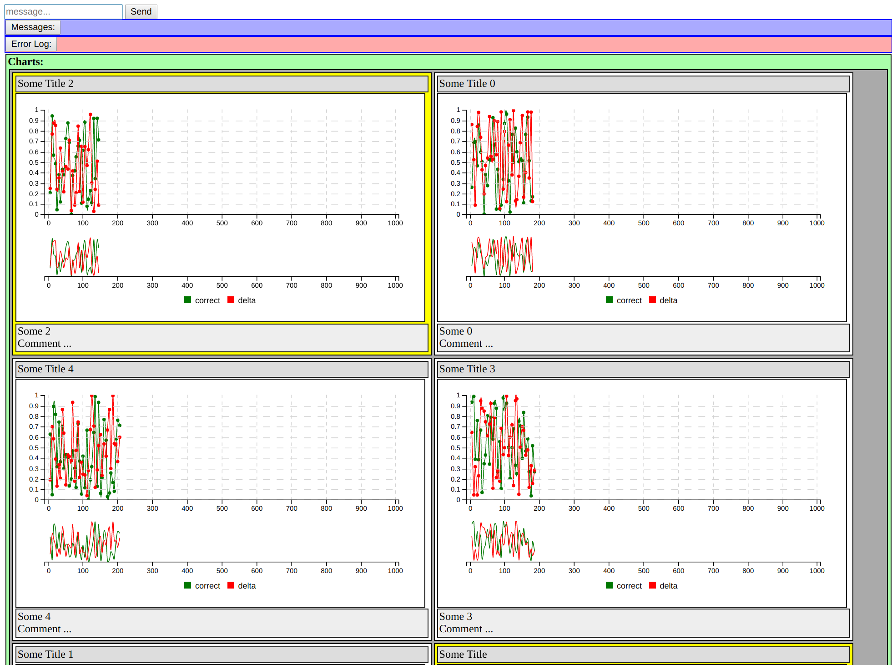

# example_app_kemal_graphs

This is an example Kemal app for displaying graphs based on json data pushed to the client via websockets.

## Installation

1. [Install Crystal](https://crystal-lang.org/docs/installation/index.html)

2. Clone this repo.

```sh
git clone https://github.com/drhuffman12/example_app_kemal_graphs
cd example_app_kemal_graphs
```

## Usage

```sh
# install dependancies
crystal deps

# run (without compiling)
bin/run

# run (with compiling)
bin/build
bin/app
```

Then, browse to http://0.0.0.0:3000/ (redirects to http://0.0.0.0:3000/dashboard).

To adjust the update speed of the graphs, type the following into the `message...` text box and click "Send":

```
bot_sleep_dur <delay>
```

For example, `bot_sleep_dur 5` will trigger a 5 second delay and `bot_sleep_dur 0.5` will trigger a half-second delay. (Be careful. How much data can your browser handle before locking up if you set the delay value too low?)



## Development

TODO: Write development instructions here


## Contributing

1. Fork it ( https://github.com/drhuffman12/example_app_kemal_graphs/fork )
2. Create your feature branch (git checkout -b my-new-feature)
3. Commit your changes (git commit -am 'Add some feature')
4. Push to the branch (git push origin my-new-feature)
5. Create a new Pull Request

## Contributors

- [drhuffman12](https://github.com/drhuffman12) Daniel Huffman - creator, maintainer
